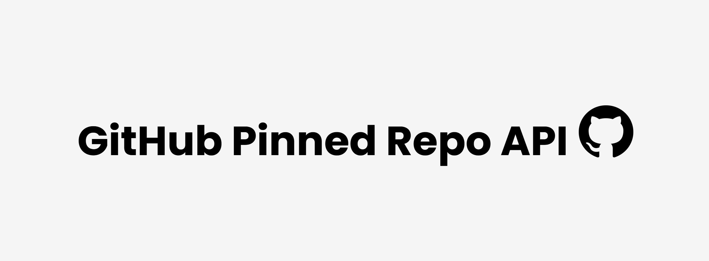

# GitHub Pinned Repo API


[](#) &nbsp;
[](#) &nbsp;
[](#) &nbsp;
[](#) &nbsp;
[](LICENSE) &nbsp;

> A high-performance, **TypeScript-powered** API that retrieves pinned repositories from a GitHub profile using a dual-mode approach: **GitHub GraphQL API** (Primary) with **Optimized Scraping** (Fallback).

## 📢 Important Notices
> [!IMPORTANT]
> The public Render instance at `https://github-pinned-repo-api.onrender.com` is best-effort. For production use, it is recommended to self-host this instance to ensure consistent availability.

## 🚀 Overview
**GitHub Pinned Repo API** provides a simple RESTful endpoint that returns pinned repository metadata in JSON format. It eliminates the complexity of authenticated requests and provides a "plug-and-play" solution for showcasing your best work.

## ✨ Features
### 🌟 Core Features
- **RESTful Routing**: Clean and modern URL structure (`/api/:username`).
- **Interactive API Docs**: Built-in **Swagger UI** for real-time API testing and exploration.
- **Dual-Mode Fetching**: Automatically uses the **GitHub GraphQL API** for lightning-fast results. If no token is provided, it seamlessly falls back to **Optimized Web Scraping**.
- **Advanced Metadata**: Supports fetching `topics`, `isArchived`, `isFork`, and `parentRepo` details.
- **Full TypeScript Support**: End-to-end type safety with shared interfaces between frontend and backend.

### ⚡ Performance & Reliability
- **Built-in Caching**: Uses `lru-cache` with a 5-minute TTL.
- **SWR Strategy (Stale-While-Revalidate)**: Serves cached data instantly while refreshing content in the background to ensure Zero-Wait response times.
- **Self-Ping Mechanism**: Integrated cron job to prevent Render instances from sleeping.

## 🛠️ Tech Stack
- **Language**: TypeScript
- **Backend**: Node.js / Express.js
- **Frontend**: Vanilla TS (compiled to JS)
- **Data Fetching**: GitHub GraphQL API & Cheerio
- **Caching**: lru-cache
- **Build Tool**: TSC (TypeScript Compiler) & Copyfiles

## 📖 API Documentation
You can explore the interactive API documentation and test the endpoints directly from your browser:

**[View Interactive Swagger Docs](https://github-pinned-repo-api.onrender.com/docs)**

## 🛠️ Usage
### Endpoint
```text
GET /api/:username
```

### Example Request
```bash
https://github-pinned-repo-api.onrender.com/api/alvinau0427
```

### Example Response
```json
[
    {
        "owner": "alvinau0427",
        "repo": "github-pinned-repo-api",
        "link": "https://github.com/alvinau0427/github-pinned-repo-api",
        "description": "Get GitHub pinned repository contents without using personal access token",
        "image": "https://opengraph.githubassets.com/1/alvinau0427/github-pinned-repo-api",
        "website": "https://github-pinned-repo-api.onrender.com",
        "language": "JavaScript",
        "languageColor": "#3178c6",
        "stars": 1,
        "forks": 0,
        "isArchived": false,
        "isFork": true,
        "parentRepo": {
            "owner": "original-owner",
            "repo": "original-repo",
            "link": "https://github.com/original-owner/original-repo"
        }
        "topics": [
            "api",
            "dynamic",
            "github-pinned-repos",
            "github-profile",
            "pinned-repos",
            "serverless",
            "awesome-portfolio",
            "github-api"
        ]
    }
]
```
> [!NOTE]  
> Advanced Metadata Behavior:
> - `topics`, `isArchived`, and `isFork` are only available in GraphQL Mode.
> - `parentRepo` only appears when `isFork` is `true`.
> - If a user has no pinned repositories, the API returns an empty array `[]`.

## 🛠️ Usage
### Installation
```bash
npm install
```

### Environment Setup
Create a `.env` file in the root directory:
```
GITHUB_TOKEN=your_personal_access_token
APP_URL=http://localhost:3000
ALLOWED_ORIGINS=http://localhost:3000,[https://your-domain.com](https://your-domain.com)
```

### Build & Start
```bash
# Compile TypeScript and copy static assets
npm run build

# Start the production server
npm start
```

## 📁 Project Structure
```
src/
├── client/     # Frontend TypeScript logic
├── server/     # Express server, Swagger config & Fetching logic
├── view/       # HTML templates
├── assets/     # Static resources (CSS, Images, Fonts)
└── types.ts    # Shared TypeScript interfaces
```

## 🎯 Use Cases
This API can be used for:
- **Developer Portfolios**: Dynamic "Projects" section on your landing page.
- **GitHub Dashboards**: Visualizing profile stats.
- **SSG Integrations**: Pre-fetch data for Astro, Next.js, or Eleventy.

## License
- github-pinned-repo-api is released under the [MIT License](https://opensource.org/licenses/MIT).
```
Copyright (c) 2026 Alvin Au

Permission is hereby granted, free of charge, to any person obtaining a copy
of this software and associated documentation files (the "Software"), to deal
in the Software without restriction, including without limitation the rights
to use, copy, modify, merge, publish, distribute, sublicense, and/or sell
copies of the Software, and to permit persons to whom the Software is
furnished to do so, subject to the following conditions:

The above copyright notice and this permission notice shall be included in all
copies or substantial portions of the Software.

THE SOFTWARE IS PROVIDED "AS IS", WITHOUT WARRANTY OF ANY KIND, EXPRESS OR
IMPLIED, INCLUDING BUT NOT LIMITED TO THE WARRANTIES OF MERCHANTABILITY,
FITNESS FOR A PARTICULAR PURPOSE AND NONINFRINGEMENT. IN NO EVENT SHALL THE
AUTHORS OR COPYRIGHT HOLDERS BE LIABLE FOR ANY CLAIM, DAMAGES OR OTHER
LIABILITY, WHETHER IN AN ACTION OF CONTRACT, TORT OR OTHERWISE, ARISING FROM,
OUT OF OR IN CONNECTION WITH THE SOFTWARE OR THE USE OR OTHER DEALINGS IN THE
SOFTWARE.
```
